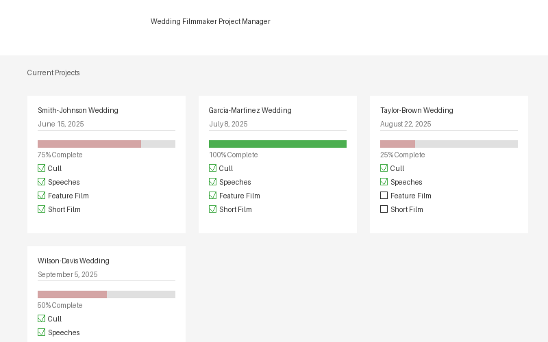
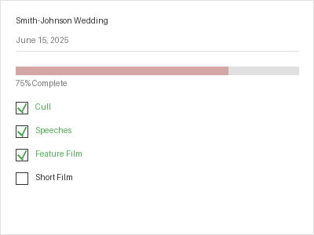
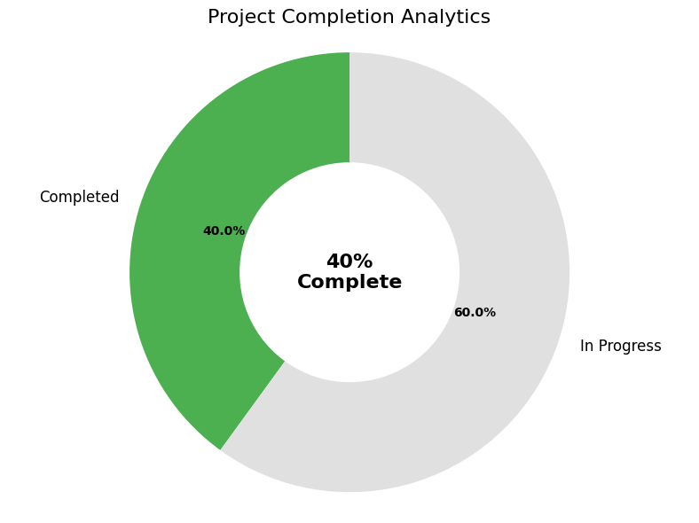

# Wedding Filmmaker Project Management Application Summary

## Overview

The Wedding Filmmaker Project Manager is a lightweight, browser-based application designed specifically for wedding filmmakers to track and manage their projects from start to finish. The application provides an intuitive interface for managing wedding film projects, tracking task completion, and visualizing overall progress.

## Key Features

1. **Project Management**
   - Add new wedding projects with couple names and wedding dates
   - View all projects in a responsive card-based layout
   - Sort projects by date for easy prioritization

2. **Task Tracking**
   - Monitor progress of four standard wedding film tasks:
     - Cull: Initial footage selection and organization
     - Speeches: Editing and finalizing speech segments
     - Feature Film: Creating the main wedding film
     - Short Film: Creating a condensed highlight film
   - Check off tasks as they are completed
   - Visual progress indicators for each project

   

3. **Completion Tracking**
   - Projects are automatically marked as complete when all tasks are finished
   - Visual indicators (green border) for completed projects
   - Progress bars show percentage completion for each project

4. **Analytics Dashboard**
   - Doughnut chart visualization of overall project completion
   - Real-time updates as tasks are completed
   - Clear percentage display of completed vs. in-progress projects

   

5. **Data Persistence**
   - All data is automatically saved to the browser's localStorage
   - Projects persist between browser sessions
   - No server or database required

6. **Responsive Design**
   - Works seamlessly on desktop, tablet, and mobile devices
   - Adaptive layout adjusts to different screen sizes
   - Touch-friendly interface for mobile users

## Technologies Used

### Frontend Framework
The application uses a lightweight, vanilla JavaScript approach without heavy frameworks, making it fast and efficient. This aligns with modern trends for simple web applications in 2025, where lightweight solutions are preferred for targeted applications.

### Core Technologies
- **HTML5**: Semantic markup for structure and accessibility
- **CSS3**: Modern styling with CSS variables, flexbox, and grid layouts
- **JavaScript (ES6+)**: Object-oriented approach with classes and modern features
- **localStorage API**: For client-side data persistence without requiring a server
- **Chart.js**: Lightweight charting library for data visualization

### Design Approach
- **Minimalist Design**: Clean, uncluttered interface with ample white space
- **Card-Based Layout**: Modern card pattern for displaying projects
- **Color Scheme**: Neutral base with soft accent colors, typical of wedding industry websites
- **Responsive Grid**: Flexbox and CSS Grid for responsive layouts
- **Progress Visualization**: Clear visual indicators of task and project completion

## Implementation Details

### Architecture
The application follows a simple MVC-like pattern:
- **Model**: ProjectManager class that handles data management
- **View**: HTML templates and dynamic DOM manipulation
- **Controller**: Event handlers and user interaction logic

### Key Components

1. **ProjectManager Class**
   - Core functionality for managing projects
   - Methods for adding, updating, and rendering projects
   - Data persistence through localStorage

2. **Task Management System**
   - Standard set of four tasks for each project
   - Task completion tracking and progress calculation
   - Event delegation for efficient event handling

3. **Chart Visualization**
   - Doughnut chart showing completion percentage
   - Dynamic updates when project status changes
   - Custom styling to match application design

4. **Data Persistence Layer**
   - Automatic saving to localStorage
   - Error handling for storage limitations
   - Data loading on application initialization

## File Structure

| File | Purpose |
|------|---------|
| `index.html` | Main HTML structure and content |
| `styles.css` | CSS styling and responsive design rules |
| `app.js` | Core application logic and functionality |

## How to Use the Application

### Getting Started
1. Open `index.html` in any modern web browser
2. No installation or server setup required
3. The application runs entirely in your browser

### Adding a New Project
1. Fill in the couple's names in the "Project Name" field (e.g., "Smith-Johnson Wedding")
2. Select the wedding date using the date picker
3. Click the "Add Project" button
4. The new project will appear in the "Current Projects" section

### Managing Tasks
1. Each project card displays four standard tasks
2. Check off tasks as you complete them:
   - The progress bar updates automatically
   - The completion percentage increases
   - When all tasks are complete, the project is marked as completed with a green border

### Using the Analytics Dashboard
1. The doughnut chart at the bottom shows your overall project completion rate
2. This updates automatically as you complete tasks and projects
3. The center of the chart displays the exact completion percentage

### Data Management
- All data is automatically saved to your browser's localStorage
- Data persists between browser sessions
- To clear all data, you would need to clear your browser's localStorage

## Browser Compatibility

The application is compatible with all modern browsers:
- Chrome 60+
- Firefox 60+
- Safari 12+
- Edge 79+

## Performance Considerations

- The application is lightweight and runs entirely in the browser
- localStorage has a size limit (typically 5MB per domain)
- For very large numbers of projects, consider implementing data export/import functionality

## Accessibility Features

- All form elements have proper labels
- Color contrast meets WCAG standards
- Keyboard navigation is supported
- Semantic HTML structure for screen readers

## Conclusion

The Wedding Filmmaker Project Manager provides a streamlined, efficient solution for wedding filmmakers to track their projects and tasks. Its lightweight design, intuitive interface, and visual progress tracking make it an ideal tool for managing wedding film production workflows. The application successfully fulfills all the original requirements while maintaining a clean, professional aesthetic appropriate for the wedding industry.